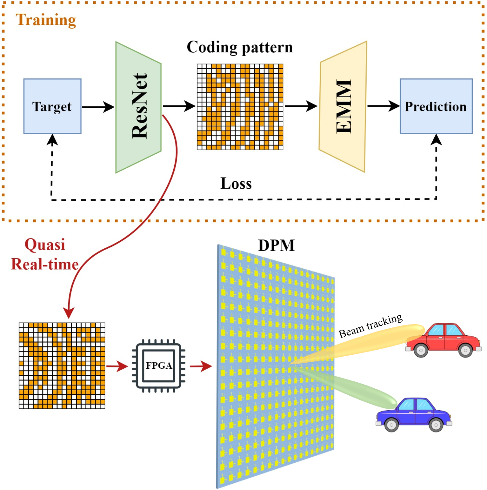

# Physiscs-Driven Deep Learning Model for Metasurface
This repository releases the Pytorch ResNet model of "Physics-Driven Unsupervised Deep Learning Network for Programmable Metasurface-Based Beamforming"

## 1. Usage
[/saved_model](/saved_model): converged ResNet34 model
[/target_uv](/target_uv): target patterns in uv-plane
[get_coding.py](get_coding.py): main python file to run, orientation of beam is changable
[resnet.py](resnet.py): definition of ResNet34 model
[utils.py](utils.py): some other useful functions

## 2. Environments 
pytorch, numpy, matplotlib, argparse, pillow, scipy